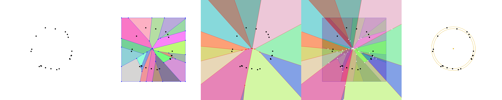

# min-annulus
Finding the smallest-width annulus enclosing a given point set.

* Point set
* Voronoi diagram in a bounding box
* Farthest-point Voronoi diagram
* Diagram overlay
* Smallest-width annulu

The algorithm consists of four steps:
* Computing a Voronoi diagram with Fortune's algorithm
* Computing a farthest-point Voronoi diagram with an incremental algorithm
* Generating a set of annulus candidates by overlaying two diagrams
* Choosing the best candidate (the one with the smallest width)
