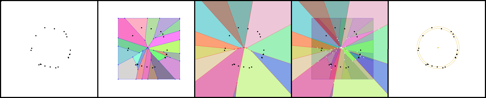

# min-annulus

Finding the smallest-width annulus (the region between two concentric circles) enclosing a given set of points. The procedure is used in practice to measure the *roundness* of physical objects based on samples from their edge. 

Done in 2018 as a Computational Geometry BSc course project.

## The algorithm
Based on Section 7.4 of the "[Computational Geometry, Algorithms and Applications](https://link.springer.com/book/10.1007/978-3-540-77974-2)" textbook.
1. Load the input set of points
2. Compute the Voronoi diagram with Fortune's algorithm
3. Compute the farthest-point Voronoi diagram (see Sec. 7.4. of the textbook) with an incremental algorithm
4. Generate a set of annulus candidates by overlaying the two diagrams
5. Choose the best candidate (the one with the smallest width)

## Example output
(Each visualization corresponds to one algorithm step)

## Dependencies
* SFML 2.3.2
